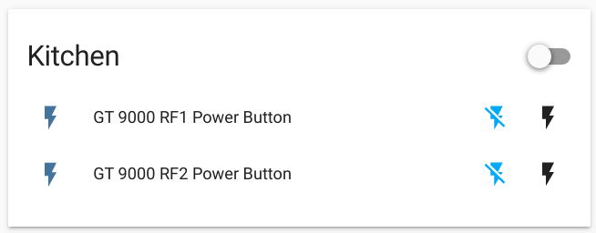

# esphome-gt9000
Iot internet and radio switch

## Compilation

```docker run --rm  --device=/dev/ttyUSB0 --net=host -v "${PWD}":/config -it esphome/esphome gt_9000.yaml run```

## Result



## Reference

https://esphome.io/guides/getting_started_command_line.html
https://github.com/sui77/rc-switch
https://esphome.io/components/esphome.html?highlight=include#esphome-includes
https://docs.platformio.org/en/latest/projectconf/section_env_library.html#lib-deps
https://esphome.io/components/switch/template.html?highlight=assumed_state
https://esphome.io/components/switch/gpio.html?highlight=turn_on_action#momentary-switch
https://esphome.io/components/switch/index.html?highlight=lambda

# esphome builtin remote_transmitter versus sui77/rc-switch

https://github.com/esphome/issues/issues/389
